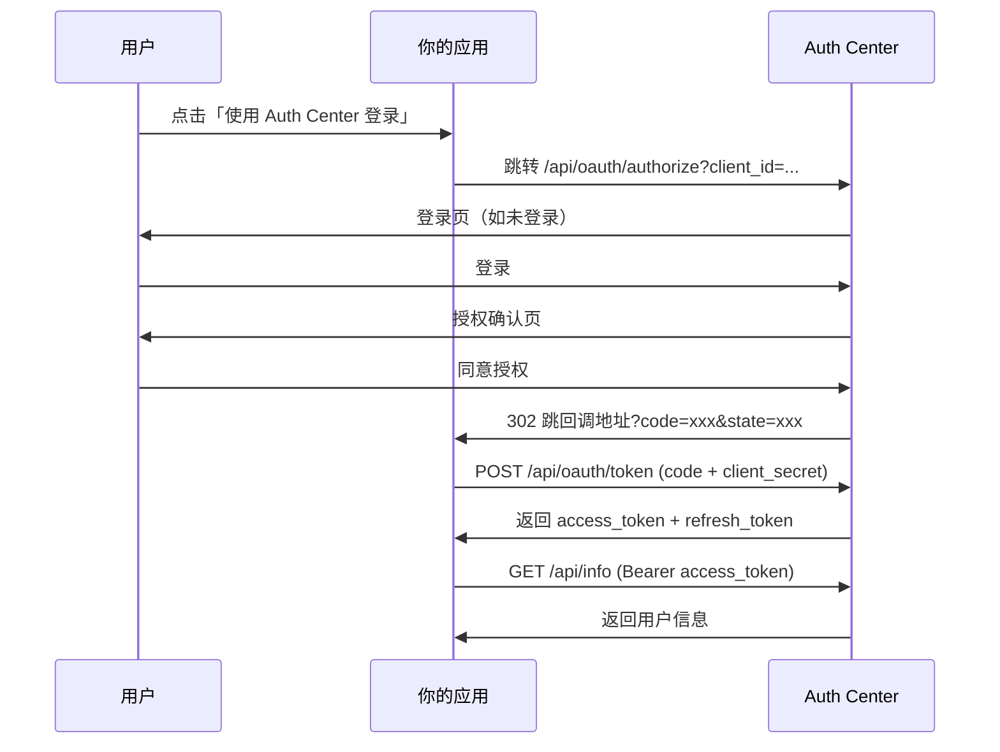

# OAuth 授权码流程

Auth Center 使用 OAuth 2.0 **授权码模式（Authorization Code）**，适合有后端的应用。这是最安全、最推荐的对接方式。

## 完整时序



## 1. 发起授权

```
GET https://auth.sanhe.com.mp/api/oauth/authorize
```

### 参数

| 参数 | 必填 | 说明 |
|------|:---:|------|
| `response_type` | ✅ | 固定 `code` |
| `client_id` | ✅ | 应用标识 |
| `redirect_uri` | ✅ | 回调地址（必须与注册时完全一致） |
| `scope` | | 逗号分隔，如 `basic,voice`，默认 `basic` |
| `state` | 推荐 | 防 CSRF 随机串，原样带回 |

### 行为

- **未登录**：302 跳转 `/login.php?next=原请求`，登录后自动回跳授权页
- **已登录 + 该应用已授权**：直接 302 跳回调地址携带 `code`
- **已登录 + 未授权**：展示授权确认页，用户点「同意」后 302 跳回调地址

### 成功回调

```
https://yourapp.com/callback?code=XXXX&state=YYYY
```

### 失败回调（错误时跳回回调地址）

```
https://yourapp.com/callback?error=access_denied&error_description=用户拒绝了授权&state=YYYY
```

| error | 说明 |
|-------|------|
| `invalid_request` | 缺少参数或 redirect_uri 不匹配 |
| `unauthorized_client` | 应用不存在或未上线 |
| `invalid_scope` | 请求了应用未申请的权限 |
| `access_denied` | 用户拒绝授权 |
| `unsupported_response_type` | response_type 错误 |

## 2. 授权确认（consent）

授权确认页的 HTML 表单会 POST 到：

```
POST /api/oauth/consent
Content-Type: application/x-www-form-urlencoded

token=xxxx&decision=allow
```

一般不需要你手动处理——用户在你跳转的授权页上点按钮即可。只有当你自己做授权页时才需要调用。

## 3. 换取令牌

```
POST https://auth.sanhe.com.mp/api/oauth/token
Content-Type: application/json
```

### 授权码换令牌

```json
{
  "grant_type": "authorization_code",
  "code": "授权码",
  "client_id": "你的client_id",
  "client_secret": "你的client_secret",
  "redirect_uri": "你的回调地址"
}
```

### 刷新令牌（access_token 过期后）

```json
{
  "grant_type": "refresh_token",
  "refresh_token": "刷新令牌",
  "client_id": "你的client_id",
  "client_secret": "你的client_secret"
}
```

### 响应

```json
{
  "access_token": "xxx",
  "token_type": "Bearer",
  "expires_in": 7200,
  "refresh_token": "xxx",
  "scope": "basic"
}
```

### 错误

| code | 说明 |
|------|------|
| 40001 | 授权码无效、已过期或已使用（授权码一次性，10 分钟有效） |
| 40002 | 刷新令牌无效或已过期 |
| 40003 | client_id 不存在 |
| 40004 | client_secret 错误 |
| 40010 | 请求过于频繁（每 IP 每分钟 30 次） |

## 4. 吊销令牌

```
POST https://auth.sanhe.com.mp/api/oauth/revoke
Content-Type: application/json

{ "token": "要吊销的令牌" }
```

吊销后该令牌立即失效（access 和 refresh 都会被吊销）。

## 权限范围（Scope）

| scope | 说明 |
|-------|------|
| `basic` | 头像、昵称、用户 ID、邮箱（默认必选） |
| `netdisk` | 访问网盘文件 |
| `voice` | 调用 TTS / STT 语音服务 |
| `notify` | 发送通知 |

## 安全建议

1. **client_secret 只存在后端**，绝不下发到浏览器/模组前端
2. **始终校验 `state`**，防止 CSRF
3. 授权码只能用一次，**用完立即换令牌**
4. 生产环境回调地址必须 HTTPS
5. access_token 过期用 refresh_token 续期，避免频繁重新授权
6. 检测到异常时调用 revoke 吊销令牌
